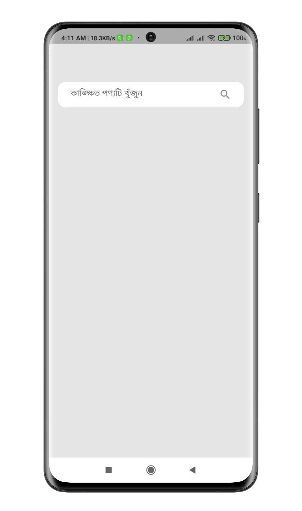
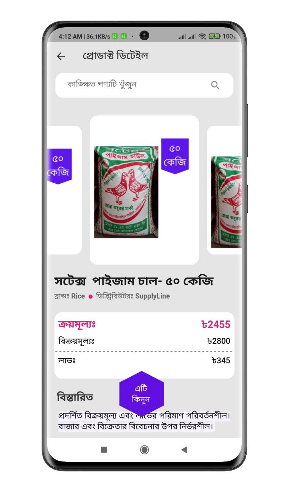

# Find Product

This is an assignment app from Qtec Solution Limited. The task is: design a search and product details page and integrate search and product details API. In the search page, the infinite product will load which means you have to add pagination.

## Screenshots

<p align="center">
  
  
</p>
<p align="center">
  
  
</p>


## Features

- Search products
- Scroll down to load infinite products
- Product details


## Setup

Clone the repository

```bash
  git clone https://github.com/muradhossin/find_product.git
```
Move to the desired folder

```bash
  cd \find_product
```
To run the app, simply write

```bash
  flutter pub get
```
```bash
  flutter run
```
## Tech Stack

**Built With:** Dart, Flutter

**State Management:** Provider

**API:** REST API


## Figma Design Link

[click here](https://www.figma.com/file/rDAWS96kl0TCxbzcMUtaPn/Flutter-Task-File-(Copy)?node-id=0%3A1&t=OBpNmXw8glk7vMwU-1)

## API Documentation
#### Search API
```bash
https://panel.supplyline.network/api/product/search-suggestions/?limit=10&offset=10&search=rice
```

Note: In the place of rice will be placed user input. And first offset is 10 then next offset is addition of your limit.

#### Product details API
```bash
https://panel.supplyline.network/api/product-details/{slug}/
```


## Platform

- Android


## Contributing

Contributions are always welcome!

See `contributing.md` for ways to get started.

Please adhere to this project's `code of conduct`.


## License

[MIT](https://choosealicense.com/licenses/mit/)


## Support

For support, please contact here [](https://linkedin.com/in/md-murad-hossin)

  💰 You can help me by Donating
  [](https://buymeacoffee.com/muradhossin) 
